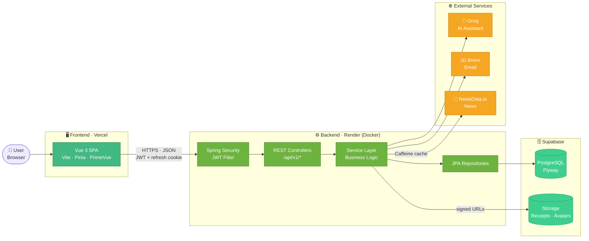
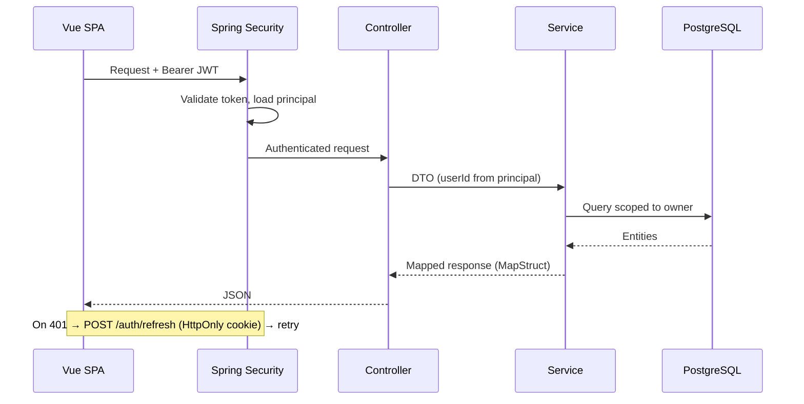

# ExpenseWise

A full-stack personal finance and expense tracker. It covers transactions, budgets, recurring payments, receipts, reports, finance news, and an AI assistant that answers questions about your own spending.

Built with **Spring Boot 3 (Java 21)** and **Vue 3**, backed by **PostgreSQL**, and deployed on **Vercel + Render + Supabase**.

---

## ✨ Features

| Module | What it does |
|---|---|
| **Auth** | Register, login, JWT access tokens + refresh-token cookie, logout / logout other sessions, forgot & reset password via email |
| **Dashboard** | Monthly overview of income, expenses, and budget usage with charts |
| **Transactions** | CRUD for income and expenses, filtering, and receipt upload (image or PDF, up to 5 MB) |
| **Categories** | Custom categories with icons |
| **Budgets** | Monthly budgets per category with progress tracking |
| **Recurring** | Recurring income/expense rules with automatic generation of due transactions |
| **Reports** | Downloadable **Excel** (Apache POI) and **PDF** (JasperReports) reports |
| **AI Assistant** | Chat and spending insights powered by Groq LLMs, grounded in your own data |
| **News** | Finance headlines from NewsData.io, cached with Caffeine |
| **Profile** | Profile edit, avatar upload, password change, login history |
| **Admin** | Admin dashboard (signups, feature usage), user management, and per-user feature entitlements |

---

## 🧱 Tech Stack

| Layer | Technology |
|---|---|
| Backend | Spring Boot 3.3, Java 21, Maven, Spring Security, Spring Data JPA, MapStruct, Lombok |
| Auth | JWT (jjwt) + bcrypt, refresh tokens stored server-side |
| Database | PostgreSQL 16 (Docker locally, Supabase in production), Flyway migrations |
| Frontend | Vue 3 (Composition API), TypeScript, Vite, Pinia, Vue Router, Axios |
| UI | Tailwind CSS 4, PrimeVue 4, Chart.js |
| File storage | Supabase Storage (private bucket, signed URLs) |
| AI | Groq (OpenAI-compatible API) |
| Email | Brevo transactional API + Thymeleaf templates |
| News | NewsData.io + Caffeine cache |
| Reports | Apache POI (Excel), JasperReports (PDF) |
| Testing | JUnit 5, Mockito, Spring integration tests, Playwright E2E |
| CI / Quality | Jenkins, SonarQube (quality gate), JaCoCo |
| Deployment | Vercel (frontend), Render via Docker (backend), Supabase (DB + storage) |

---

## 🏗️ Architecture



### Request flow



The backend is organized **by feature**: `auth`, `user`, `transaction`, `category`, `budget`, `recurring`, `receipt`, `report`, `ai`, `news`, `dashboard`, `admin`, `entitlement`. Each package has its own `controller / service / repository / entity / dto / mapper` layers.

---

## 📁 Project Structure

```
ExpenseWise/
├── backend/                 # Spring Boot API
│   ├── src/main/java/com/expensewise/
│   ├── src/main/resources/
│   │   ├── db/migration/    # Flyway migrations (V1…V6)
│   │   └── application*.yml # local / prod profiles
│   ├── Dockerfile           # Multi-stage build for Render
│   └── .env.example
├── frontend/                # Vue 3 + Vite SPA
│   ├── src/                 # views, components, stores, api, router
│   ├── e2e/                 # Playwright tests
│   └── .env.example
├── ci/                      # Docker Compose for Jenkins / SonarQube / CI DB
├── docker-compose.yml       # Local PostgreSQL
├── Jenkinsfile              # CI pipeline
├── DEPLOYMENT.md            # Production deployment guide
└── DECISIONS.md             # Architecture decision log
```

---

## 🚀 Getting Started

### Prerequisites

- Java 21 and Maven 3.9+
- Node.js 20+
- Docker (for the local database)

### 1. Start the database

```bash
docker compose up -d
```

This starts PostgreSQL 16 on **localhost:5433** (db `expensewise`, user `dev` / `devpass`).

### 2. Configure environment variables

All backend variables use the `_EXPENSEWISE` suffix so they don't collide with other projects. See `backend/.env.example` for the full list.

| Variable | Required | Purpose |
|---|---|---|
| `DB_URL_EXPENSEWISE` / `DB_USER_EXPENSEWISE` / `DB_PASSWORD_EXPENSEWISE` | ✅ | Database connection |
| `JWT_SECRET_EXPENSEWISE` | ✅ | JWT signing secret |
| `GROQ_API_KEY_EXPENSEWISE`, `GROQ_MODEL_EXPENSEWISE` | ✅* | AI assistant |
| `SUPABASE_URL_EXPENSEWISE`, `SUPABASE_SERVICE_KEY_EXPENSEWISE`, `SUPABASE_BUCKET_EXPENSEWISE` | ✅* | Receipt and avatar storage |
| `BREVO_API_KEY_EXPENSEWISE`, `MAIL_FROM_EXPENSEWISE` | Optional | Email. If unset, reset links are logged to the console |
| `NEWSDATA_API_KEY_EXPENSEWISE` | Optional | News feed |
| `FRONTEND_URL_EXPENSEWISE` | Optional | Defaults to `http://localhost:5173` |

\* The app starts with placeholder values, but the related feature won't work until a real key is set.

For the frontend, `frontend/.env`:

```env
VITE_API_BASE_URL=http://localhost:8080/api/v1
```

### 3. Run the backend

```bash
cd backend
mvn spring-boot:run
```

Flyway runs the migrations automatically on startup. The API runs at `http://localhost:8080/api/v1` (health check: `GET /api/v1/health`).

### 4. Run the frontend

```bash
cd frontend
npm install
npm run dev
```

Open `http://localhost:5173`.

---

## 🧪 Testing

```bash
# Backend: unit + integration tests (needs the local Postgres running)
cd backend && mvn verify

# Frontend: Playwright E2E (backend + frontend running)
cd frontend && npm run test:e2e
```

External services (Groq, Supabase Storage, NewsData, email) are mocked in backend tests, so no real API keys are needed.

---

## 🔄 CI/CD

The `Jenkinsfile` defines a pipeline triggered by SCM polling on `main`:

**Checkout → Backend Build & Test → Frontend Build → SonarQube Analysis → Quality Gate → Archive**

Jenkins, SonarQube, and a dedicated CI Postgres run in Docker (see `ci/docker-compose.yml`). JaCoCo coverage is sent to SonarQube, and the build fails if the quality gate fails.

---

## ☁️ Deployment

| Piece | Platform |
|---|---|
| Frontend | Vercel (static Vite build) |
| Backend | Render (Docker web service from `backend/Dockerfile`, `SPRING_PROFILES_ACTIVE=prod`) |
| Database + storage | Supabase (Supavisor pooler, port 6543, `?prepareThreshold=0`) |

The frontend and backend live on different domains, so production uses explicit CORS origins and a `SameSite=None; Secure` refresh cookie. Full step-by-step instructions are in **[DEPLOYMENT.md](DEPLOYMENT.md)**.

---

## 🔐 Engineering Principles

- **Money** is always `BigDecimal` / `DECIMAL(12,2)`. Never floating point.
- **Time** is stored as UTC `TIMESTAMPTZ` and converted to `Asia/Kuala_Lumpur` only in the UI.
- **Ownership** is checked server-side on every endpoint. User IDs come only from the authenticated principal.
- **Schema** changes go through Flyway only (`ddl-auto: validate`).
- **Secrets** stay in backend env vars. The Supabase service key never reaches the frontend.
- **Passwords** use bcrypt, and reset tokens are hashed, single-use, and expiring.

---

## 👤 Author

**Muhammad Danial Syafiq Bin Ermiza**
GitHub: [@danial2910](https://github.com/danial2910)
